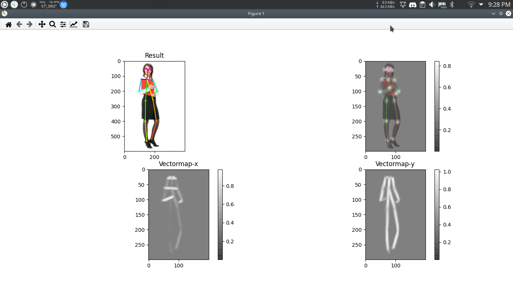
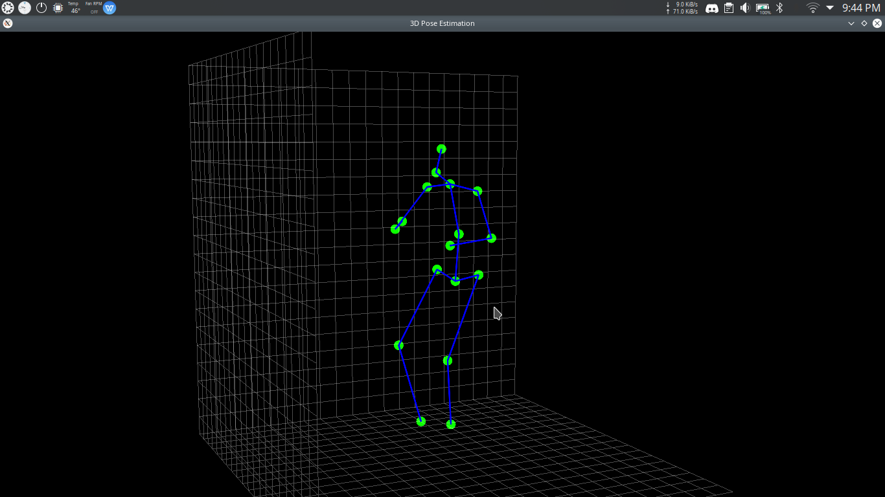

# Programming Industrial Robot using Natural user Interection.


This servise is based on Django server which contain REST API to entertain the REACT frontend server called PICNUI_FrontEnd. The server is resposnible for some services given below
1.  This first module of the project is Robot Learning Management System (RLMS). The project mainly uses RLMS to manage the trainings of robots. It allows the trainer to add, edit, or delete the different training routines and robot’s profiles. 
2. The project uses Gesture Recognition as a primary mean for interacting with the system using Sensor attached to the computer. Based on that information system will extract the content of interest, through Machine Learning libraries i.e. TensorFlow. TensorFlow is used to make trained models by using a particular algorithm which in our case is Convolution Neural Network (CNN). A High-level API ‘Keras’ which uses TensorFlow at its back-end. In this particular scenario, gestures are specific to hand, arm and elbow. Images are fed to Keras which use CNN as its algorithm through TensorFlow and trains the model.This PICNUI_Backend is used to get 3d point cloud from the frame provided by user from Camera or kinect RGB camera.  Once, the 3d point are recognized a meaningful output is generated and sent to 3rd module.
3. The project supports two environments (i) WEBOTS Simulations and (ii) UR Virtual Machine. Interpreter will decide which environment is to be used. UR Virtual Machine (URVM) will get extracted features to generate Poly-scope commands and then deploy them on cobot. Cobot will give responses according to commands in the simulated environment. WEBOTS Simulations will get the inputs from the interpreter and will send actions to the cobots using a high-level language, in our case it is Python. Actions will be decided intelligently by a system based on user interaction. Actions will be stored in the memory of cobot and the system will enable the cobot to repeat the task to improve the accuracy of movement. 

The below image calculate the 2d Point cloud and its vectormap 


The below image calculate the 3d point cloud and show it in PYQTGraph



## Installation:
#### ubuntu:
1. First of all install cmake gcc and build essentials by this command
```
	sudo apt update 
	sudo apt-get install git cmake build-essential libusb-1.0-0-dev
	sudo apt install python-numpy
	sudo apt-get install libgl1-mesa-dev
	sudo apt-get install python-dev python3-dev
	sudo apt-get install libopencv-*
	pip install opencv-contrib-python
```


2. Install anaconda from its website <https://docs.anaconda.com/anaconda/install/>

3.  Create Conda ENV:

```
	conda create -n  AIMachine
	conda activate AIMachine
	conda install anaconda
	conda install python==3.7.6
	conda install opencv
	conda install tensorflow
```


4. Install libfreenect library :

```
	mkdir bin && cd bin
	git clone https://github.com/OpenKinect/libfreenect
	cd libfreenect
	mkdir build  && cd build
	cmake .. -DBUILD_PYTHON3=ON -DCYTHON_EXECUTABLE=/home/$USER/anaconda3/envs/AIMachine/bin/cython -DCMAKE_INSTALL_PREFIX=/home/$USER/anaconda3/envs/AIMachine -L
	sudo make install
	cd ../wrappers/python
	python setup.py install
	cd ../../../
```

5. Install tf-pose Estimation using these links:

```
	git clone https://github.com/gsethi2409/tf-pose-estimation.git
	cd tf-pose-estimation
	pip install -r requirements.txt
	conda install swig
	pip install tf-slim
	cd tf_pose/pafprocess
	swig -python -c++ pafprocess.i && python3 setup.py build_ext --inplace
	cd ../../
	pip install git+https://github.com/adrianc-a/tf-slim.git@remove_contrib
	cd models/graph/cmu
	bash download.sh
	cd ../../..
	python setup.py install
```
6. Install Additional libraries for Server:

```
    pip install pyqtgraph
    pip install PyOpenGL
    pip install djongo
    pip install djangorestframework
    pip install django-cors-headers
```
7. Install additional libraries for WEBOTS 

```
	sudo apt install ffmpeg
	sudo apt install libfreeimage3
	sudo apt install libfreeimage3
	sudo apt install libssh-dev
	sudo apt install libzip-dev
```

8. Install webots enviornment  .deb package from its website <https://cyberbotics.com/doc/guide/installation-procedure?tab-language=python/>

9. Install Libraries for support of python with webots:
```
	pip install ikpy
	pip install lxml
```

10. For Pycharm support follow the below steps:
	1. Open the project in pycharm.
	2. Select File > Settings > Python Interpreter > add > Conda Envirnoment.
	3. Select Exisiting Envirnoment > Select "AIMachine" envirnoment > Press Apply.
	4. Select Project Structure from the project explorer panel present at left side.
	5. Click on "Add Content Root" Button and the path chooser dialog box will appear.
	6. Select the python38 folder which resides in the installation directory of the webots and press Ok.
	7. The path will look like as follows:
	```
	/usr/local/webots/lib/controller/python38
	```
	8. To find the installation directory of webots in ubuntu or linux, just type the following command on the terminal.
	```
	which webots
	```
	9. Open Edit Configration present on top right corner besides the run button.
	10. Add the following configurations:
		1. manage.py configuration: 
			1. Click on "Add new Configuration" and then select python.
			2. Enter the name = "manage".
			3. In script path, select the manage.py script path present within the project.
			4. Enter the parameters to "runserver".
			5. In Project field, select the root folder of the project.
			6. In Envirnoment Variables, add the following envirnoment variables:
			```
			LD_LIBRARY_PATH = /usr/local/webots/lib/controller
			 WEBOTS_ROBOT_NAME = UR10e
			```
			7. Make sure that the python interpreter is set to "AIMachine" conda envirnoment.
			8. In the working directory field, select the path to the project root folder (picnui-djangoserver).
			7. Make check the below two checkboxes and press Apply and then Ok. 
		2. UR10eController.py configuration:
			1. Click on "Add new Configuration" and then select python.
			2. Enter the name = "UR10eController".
			3. In script path, select the UR10eController.py script path present within the project.
			4. In Project field, select the root folder of the project.
			5. In Envirnoment Variables, add the following envirnoment variables:
			```
			LD_LIBRARY_PATH = /usr/local/webots/lib/controller
			WEBOTS_ROBOT_NAME = UR10e
			```
			6. Make sure that the python interpreter is set to "AIMachine" conda envirnoment.
			7. In the working directory field, select the path to the testExtController folder presnet within the src folder of the project.
			8. Make check the below two checkboxes and press Apply and then Ok. 

11. For Webots support follow the below steps:
	1. Open Webots application
	2. Select File > Open  World and a file chooser will appear.
	3. Navigate to the following file within the picnui-djangoserver project.
	4. Select server > src > testExtController > ure.wbt and press OK. The Virtual World will be loaded. 
	5. In Project Structure panel present on left side > Select UR10e node.
	6. Set the following properties of this node:
	```
	 controller = <extern>
	 sychrinization = TRUE
	```
	7. Run the Simulation


## Usage:
1. In order to run the server enter the command:
```
    python manage.py runserver
```

2. In order to run the 3d live Tracking Enter the command: 
```
    python 3dTracking.py --model="cmu"
```
